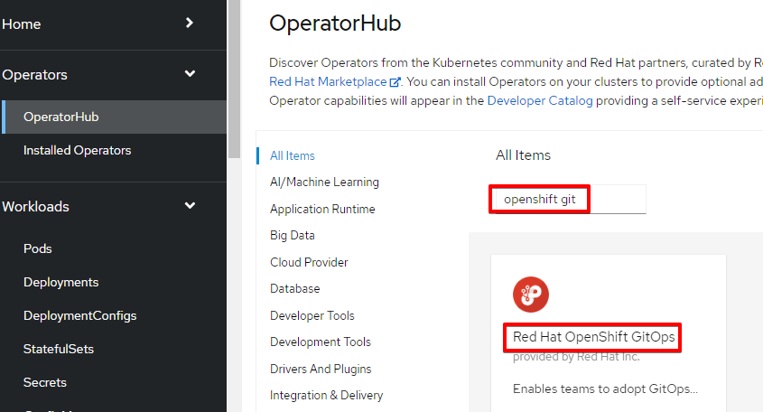
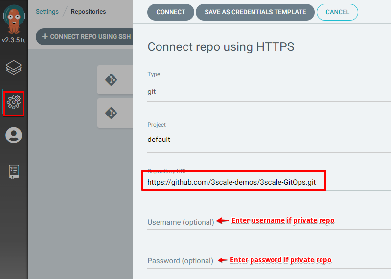

# 3scale Configuration - GitOps Tutorial

The following tutorial provide steps on leveraging GitOps to configure 3scale using 
3scale CRs (Product, Backend CRs etc.)

## Prerequisites
- 3scale operator being installed (from operatorhub) either should be cluster wide operator(introduced in 3scale 2.12) or if it is namespace specific then the operator should be installed in the namespace where the 3scale CRs are to be applied using GitOps
- Install 3scale using APIManager CR (CR is not included). Please follow [Provision OpenShift Data Foundation](https://github.com/3scale-demos/ossm-3scale-wasm#provision-openshift-data-foundation) and [Provision 3scale](https://github.com/3scale-demos/ossm-3scale-wasm#provision-3scale) to install 3scale

## Install RH OpenShift GitOps
Install Red Hat OpenShift GitOps operator from the OperatorHub in the OCP webconsole



This will automatically create 
- `openshift-gitops` namespace 
- `ArgoCD` CR with the name `openshift-gitops` in openshift-gitops namespace.
 `ArgoCD` CR creates a bunch of deployments. These deployments together make ArgoCD application
- `AppProject` CR with the name `default` in openshift-gitops namespace.

## Login to OpenShift GitOps
Go to the login page using the route URL it creates as `openshift-gitops-server` in `openshift-gitops` namespace.

You can login to `OpenShift GitOps` using the `admin` user that comes with ArgoCD deployment OR using
OpenShift as oauth provider by clicking the button `LOG IN VIA OPENSHIFT`.

Find the password for the admin in `openshift-gitops-cluster` secret in `openshift-gitops` namespace.

## Create 3scale namespace and secret
Create a namespace say `3scale-dev` where GitOps will apply CRs and create the secret required for 3scale CRs to authenticate with 3scale

```
oc new-project 3scale-dev
oc create secret generic 3scale-admin-dev-secret --from-literal=adminURL=https://3scale-admin.apps.cluster-2q76v.2q76v.sandbox955.opentlc.com --from-literal=token=<3scale admin access token>
```

## Enabling RBAC
Create cluster role to create, update, delete 3scale CRs (Need to have OCP admin access for this)

```
oc apply -f rbac/ClusterRole_gitops-threescale-access.yaml
```
Assign the cluster role to sa `openshift-gitops-argocd-application-controller`

```
oc adm policy add-role-to-user gitops-threescale-access system:serviceaccount:openshift-gitops:openshift-gitops-argocd-application-controller -n 3scale-dev (namespace where 3scale CRs to be applied)
```

## Create ArgoCD Application
 
Create the ArgoCD Application. Namespace where 3scale CRs are to be created is assumed as `3scale-dev`. Please change the `namespace` attribute under `spec->destination` in the `gitops/Application_threescale-dev.yaml` to align with your environment

```
oc apply -f gitops/Application_threescale-dev.yaml -n openshift-gitops
```

## Connect the git repository

Configure the repositories to be connected by the ArgoCD application 

Click `Manage your repositories, projects, settings` icon on the left panel of the ArgoCD console, Click 
`Repositories` and Click either `Connect repo using SSH` OR `Connect repo using HTTPS` and fill in the form as shown below and click `CONNECT`. Make sure it is SUCCESSFUL.



## 3scale CRs
**Please note that the directory structure used for 3scale CRs are for the tutorial purpose only. Please adjust based on the needs**

3scale CRs required for this tutorial are spread under multiple directories and uses kustomize plugin 
to replace and merge the environment specific values

- `base` - 3scale manifest attributes that are common for all environments are housed here (spread under different directories i.e. `products`, `backends` etc.)

- `overlays/dev` - 3scale manifest attributes that are specific for dev environment and different from base are housed here (spread under different directories i.e. `products`, `backends` etc.)
